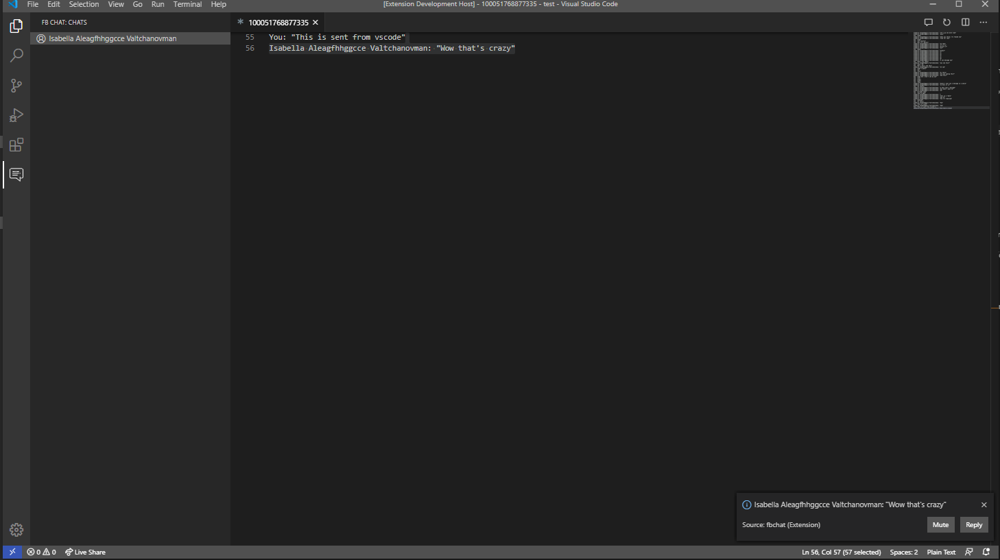

# FB Chat

This extension allows you to send and recieve Facebook messenger messages within vscode

**NOTE: This extension uses an unofficial facebook api which involves entering your username and password. Use at your own risk.**  
You can check out the library used [here](https://github.com/Schmavery/facebook-chat-api)

## Features

* Notifications
* Send messages
* View threads
* Send code as message

## Requirements

* A Facebook account

## Extension Settings
This extension contributes the following settings:

* `fbchat.showNotifications`: enable/disable notifications from popping up

## Known Issues

Facebook username and password must be entered due to their api restricted only to bots

## Release Notes

### 0.1.0

Initial release
